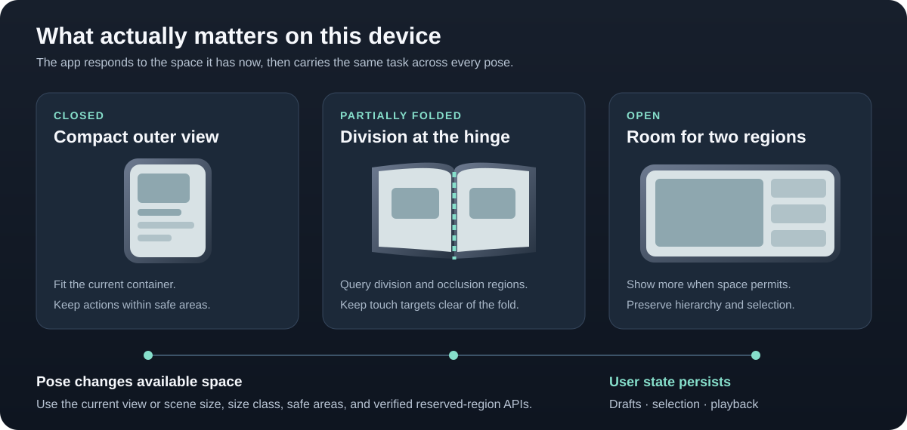

# iPhone Duo Skill

한국어 | [English](README.en.md) | [日本語](README.ja.md)


메일과 사진 라이브러리를 화면 양쪽에 나란히 띄워 쓰는 모습을 보여주는 독자 제작 콘셉트 이미지입니다. 실제 제품 사진이나 정확한 하드웨어 도면은 아닙니다.

한국어·영어·일본어로 제공하는 iOS 개발 스킬입니다. SwiftUI와 UIKit 앱의 Duo 대응을 점검하고 구현·검증하도록 안내합니다.

## 이 기기에서 실제로 중요한 것



자세가 바뀌면 앱이 사용할 수 있는 공간도 달라집니다. 현재 view/scene의 크기와 safe area를 기준으로 레이아웃을 정하고, 필요할 때만 SDK에서 확인한 reserved-region API로 접힘·가림 영역을 처리합니다. 개폐 중에도 입력 초안, 선택, 재생 위치를 유지합니다. [Apple의 Duo 개발자 자료](https://developer.apple.com/iphone-duo/)를 바탕으로 그린 개념도입니다.

## 포함된 스킬

| 스킬 | 범위 |
|---|---|
| [iphone-duo](skills/iphone-duo/SKILL.md) | Duo 개폐·레이아웃·다중 화면·카메라 |
| [ios-27-migration](skills/ios-27-migration/SKILL.md) | iOS 27 변경 매핑·업데이트 설치·의존성 점검 및 수정·검증 |

## 보완한 내용

- 실제 SDK에서 확인한 API만 구현하고 구 OS 대체 동작 유지
- 화면 개폐·리사이즈 시 탐색 및 편집 상태 보존
- safe area, 세로 바, 다중 scene, 카메라 전환의 조건별 지침
- 접근성·지역화·오류 복구와 실제 수행 여부를 구분하는 검증표
- Codex용 UI 메타데이터, 공식 출처와 원본 라이선스 보존

스킬 본문: [skills/iphone-duo/SKILL.md](skills/iphone-duo/SKILL.md)

세 언어는 같은 내용을 담으며 함께 갱신합니다. 등록 진입점은 `SKILL.md` 하나이고, 가이드는 한 언어와 필요한 참조만 읽도록 구성했습니다.

## 설치

`npx skills`로 저장소에 포함된 스킬을 확인하거나 설치할 수 있습니다.

```sh
# 설치 가능한 스킬 확인
npx skills add DamDamStudio/iPhone-Duo-Skill --list

# 원하는 스킬 설치
npx skills add DamDamStudio/iPhone-Duo-Skill --skill iphone-duo
npx skills add DamDamStudio/iPhone-Duo-Skill --skill ios-27-migration
```

Codex에 전역으로 두 스킬을 설치하려면 다음과 같이 실행합니다.

```sh
npx skills add DamDamStudio/iPhone-Duo-Skill \
  --skill iphone-duo \
  --skill ios-27-migration \
  --agent codex \
  --global
```

### 수동 설치

이 저장소를 내려받은 상태라면 루트에서 아래 명령을 실행할 수 있습니다. 같은 이름의 스킬이 있으면 덮어쓰지 않고 중단합니다.

```sh
skill_root="${CODEX_HOME:-$HOME/.codex}/skills"
mkdir -p "$skill_root"
if [ -e "$skill_root/iphone-duo" ] || [ -L "$skill_root/iphone-duo" ]; then
  echo "iphone-duo가 이미 있습니다. 기존 파일을 확인한 뒤 병합하세요."
else
  cp -R skills/iphone-duo "$skill_root/iphone-duo"
fi
```

다른 스킬을 수동 설치하려면 명령의 `iphone-duo`를 `ios-27-migration`으로 바꾸세요. Claude Code에서는 선택한 스킬 폴더를 프로젝트의 `.claude/skills/` 아래에 복사할 수 있습니다. 참조와 번역 파일도 함께 유지하세요.

iOS 27 스킬은 신규 기능 도입 없이 기존 동작 보존에 집중합니다. 두 스킬은 각각 설치할 수 있습니다.

## 사용 예시

```text
$ios-27-migration 이 앱의 iOS 27 호환성을 점검하고 확인된 문제를 수정·검증해줘.
$iphone-duo 이 앱을 Duo에 대응해줘. 현재 SDK에서 가능한 수정부터 하고 검증해줘.
$iphone-duo 접고 펼칠 때 상세 화면과 입력 내용이 유지되는지 점검해줘.
$iphone-duo 카메라 화면의 전환·미러링·녹화 유지 문제를 수정해줘.
```

2026-09-15 기준 [Apple 안내](https://developer.apple.com/iphone-duo/)는 Xcode 27.1 beta를 이달 말 제공 예정으로 표시합니다. SDK가 부족하면 일반 적응형 UI 개선을 진행하고 Duo 전용 검증은 별도로 남기도록 설계했습니다.

## 라이선스와 출처

이 저장소의 [MIT 라이선스](LICENSE)와 기반 저작물의 [MIT 고지](skills/iphone-duo/LICENSE.upstream)를 참고하세요. 공식 자료와 확인 범위는 [출처 기록](skills/iphone-duo/references/sources.md)에 정리했습니다.
